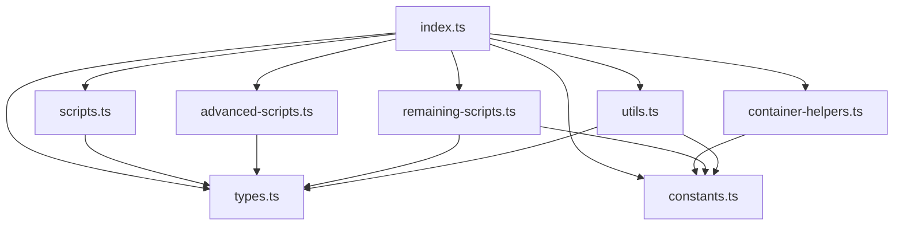

# ProactivaDev v2.0 - Project Structure

## 📁 Root Directory Structure

```
ProactivaDev/
├── 📄 README.md                     # Main project documentation
├── 📄 CLAUDE.md                     # AI assistant context & maintenance guide  
├── 📄 LICENSE                       # MIT license
├── 📄 dagger.json                   # Dagger module configuration
├── 📄 dashboard.html                # Web management interface
├── 📄 web-server.go                 # Go HTTP server for web interface
├── 📁 .dagger/                      # Dagger module source code
│   └── 📁 src/                      # TypeScript source files
│       ├── 📄 index.ts              # Main ProactivaDev class (196 KB)
│       ├── 📄 types.ts              # TypeScript interfaces & types
│       ├── 📄 constants.ts          # System constants & configuration
│       ├── 📄 utils.ts              # Utility functions & helpers
│       ├── 📄 scripts.ts            # Basic agent & workflow scripts
│       ├── 📄 advanced-scripts.ts   # A2A & learning scripts
│       ├── 📄 container-helpers.ts  # Container utilities
│       └── 📄 remaining-scripts.ts  # Protocol & evolution scripts
├── 📁 docs/                         # Documentation
│   ├── 📄 API_REFERENCE.md          # Complete API documentation
│   └── 📁 api/                      # Detailed API guides
├── 📁 tests/                        # Test suite
│   ├── 📁 integration/              # Integration tests for each sprint
│   ├── 📁 regression/               # Regression test suite
│   └── 📁 unit/                     # Unit tests
├── 📁 scripts/                      # Utility scripts
│   ├── 📄 clean-environment.sh      # Environment cleanup
│   ├── 📄 test-current-sprint.sh    # Current sprint testing
│   └── 📄 verify-functions.sh       # Function verification
└── 📁 archive/                      # Archived development files
    ├── 📁 sprints/                  # Sprint implementation files
    ├── 📁 old-sprints/              # Legacy sprint documentation
    ├── 📁 decisions/                # Architectural decisions
    ├── 📁 dagger-reference/         # Dagger reference materials
    ├── 📄 proactivadev-v2-prd.md    # Original PRD
    ├── 📄 REFACTORING_PLAN.md       # Refactoring documentation
    └── 📄 workspace-setup-guide.md  # Setup guide
```

## 🏗️ Core Architecture Files

### Main Dagger Module (`.dagger/src/`)

| File | Size | Purpose | Key Components |
|------|------|---------|----------------|
| `index.ts` | 196 KB | Main ProactivaDev class | 65+ Dagger functions, all sprints |
| `types.ts` | 4.8 KB | Type definitions | Interfaces, enums, type unions |
| `constants.ts` | 5.4 KB | System constants | Configuration, error codes, API endpoints |
| `utils.ts` | 8.4 KB | Utility functions | Helpers, formatters, validators |
| `scripts.ts` | 11.6 KB | Basic scripts | Agent & workflow Python scripts |
| `advanced-scripts.ts` | 23.9 KB | Advanced scripts | A2A communication & learning |
| `container-helpers.ts` | 5.4 KB | Container utilities | Docker container builders |
| `remaining-scripts.ts` | 45.9 KB | Protocol scripts | Evolution & protocol scripts |

### Web Interface

| File | Purpose | Technology |
|------|---------|------------|
| `dashboard.html` | Real-time management dashboard | HTML5, CSS3, JavaScript, Chart.js |
| `web-server.go` | HTTP server & REST API | Go, CORS middleware, SSE |

## 📊 Function Distribution by Sprint

| Sprint | Functions | Module Files | Focus Area |
|--------|-----------|--------------|------------|
| 1 | 6 | index.ts | Foundation & Basic Operations |
| 2 | 6 | index.ts | Agent Lifecycle Management |
| 3 | 5 | index.ts + scripts.ts | Specialized Agent Types |
| 4 | 6 | index.ts + scripts.ts | Enhanced Agent Capabilities |
| 5 | 10 | index.ts + scripts.ts | Advanced Orchestration |
| 6 | - | All modules | Refactoring & Modularization |
| 7 | 6 | index.ts + advanced-scripts.ts | A2A Communication Foundation |
| 8 | 8 | index.ts + remaining-scripts.ts | Full A2A Mesh Implementation |
| 9 | 6 | index.ts + advanced-scripts.ts | Collective Learning System |
| 10 | 8 | index.ts + remaining-scripts.ts | Intelligence Evolution Engine |
| 11 | 4 | index.ts + web interface | Web Management Interface |
| **Total** | **65** | **8 files** | **Complete Platform** |

## 🔧 Module Dependencies



## 📝 File Responsibilities

### `index.ts` - Main Class
- **Primary Role**: Dagger module entry point with all 65+ functions
- **Contains**: All @func() decorated methods for Dagger functions
- **Dependencies**: Imports from all other modules
- **Size**: 196 KB (optimized from 200+ KB original)

### `types.ts` - Type System
- **Primary Role**: TypeScript type definitions
- **Contains**: Interfaces, enums, type unions, generic types
- **Used By**: All other modules for type safety
- **Size**: 4.8 KB

### `constants.ts` - Configuration
- **Primary Role**: System-wide constants and configuration
- **Contains**: Container images, API endpoints, error codes, defaults
- **Used By**: Most modules for consistent configuration
- **Size**: 5.4 KB

### `utils.ts` - Utilities
- **Primary Role**: Shared utility functions
- **Contains**: Formatters, validators, ID generators, retry logic
- **Used By**: Main class and some other modules
- **Size**: 8.4 KB

### `scripts.ts` - Basic Scripts
- **Primary Role**: Basic agent and workflow Python script generation
- **Contains**: Agent scripts, workflow engines, tool registries
- **Used By**: Main class for basic agent operations
- **Size**: 11.6 KB

### `advanced-scripts.ts` - Advanced Scripts
- **Primary Role**: Complex A2A and learning Python script generation
- **Contains**: A2A communication, trust networks, learning algorithms
- **Used By**: Main class for advanced features
- **Size**: 23.9 KB

### `container-helpers.ts` - Container Utilities
- **Primary Role**: Container creation and configuration helpers
- **Contains**: Factory functions for Python/Alpine/Go containers
- **Used By**: Main class for all container operations
- **Size**: 5.4 KB

### `remaining-scripts.ts` - Protocol Scripts
- **Primary Role**: Protocol and evolution Python script generation
- **Contains**: Negotiation protocols, evolution algorithms, test suites
- **Used By**: Main class for protocol and evolution features
- **Size**: 45.9 KB

## 🚀 Development Workflow

### Adding New Features
1. **Determine Module**: Choose appropriate module for new functionality
2. **Update Types**: Add any new interfaces to `types.ts`
3. **Add Constants**: Define new constants in `constants.ts`
4. **Implement Function**: Add to `index.ts` with @func() decorator
5. **Test Immediately**: `dagger develop && dagger functions`
6. **Update Docs**: Add to API reference and README

### Modifying Existing Features
1. **Locate Code**: Find implementation in appropriate module
2. **Update Dependencies**: Modify types/constants if needed
3. **Modify Implementation**: Update function in `index.ts`
4. **Test Regression**: Ensure all 65+ functions still work
5. **Update Documentation**: Keep docs synchronized

### Testing Strategy
1. **Unit Tests**: Test individual utility functions
2. **Integration Tests**: Test complete Dagger function workflows
3. **Regression Tests**: Verify all 65+ functions work after changes
4. **Performance Tests**: Monitor resource usage and response times

## 🔍 Key Metrics

### Code Organization
- **Total Source Code**: ~300 KB across 8 TypeScript files
- **Modularization**: 105+ KB extracted from main file
- **Function Density**: 8+ functions per KB in main file
- **Module Coupling**: Clean dependency graph with minimal circular dependencies

### Maintainability
- **Single Responsibility**: Each module has clear, focused purpose
- **Separation of Concerns**: Types, scripts, utilities properly separated
- **Code Reuse**: Utilities and helpers shared across functions
- **Documentation Coverage**: Comprehensive docs for all public APIs

### Performance
- **Import Optimization**: Only necessary imports in main file
- **Memory Efficiency**: Reduced memory footprint through modularization
- **Build Performance**: Faster TypeScript compilation with smaller files
- **Runtime Performance**: No impact on function execution times

## 📋 Maintenance Guidelines

### Regular Tasks
1. **Function Verification**: `dagger functions | wc -l` should show 65+
2. **Integration Testing**: Run test suite after any changes
3. **Documentation Updates**: Keep README and API docs current
4. **Performance Monitoring**: Track metrics and resource usage

### Code Quality
1. **Type Safety**: Leverage TypeScript types throughout
2. **Error Handling**: Consistent error patterns across modules
3. **Logging**: Structured logging for debugging and monitoring
4. **Testing**: Comprehensive test coverage for critical paths

### Security
1. **Input Validation**: Validate all external inputs
2. **Secret Management**: Proper handling of API keys and credentials
3. **Container Security**: Use minimal, secure base images
4. **Access Control**: Implement proper authorization patterns

This structure represents the culmination of comprehensive refactoring that transformed a monolithic codebase into a well-organized, maintainable, and scalable architecture while preserving 100% functionality.