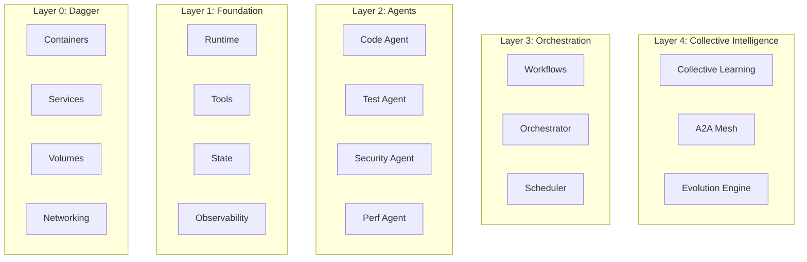

# Product Requirements Document: ProactivaDev v2.0
## Enterprise-Grade Agentic Development Platform with Collective Intelligence

**Version:** 2.0  
**Date:** February 2025  
**Status:** Fresh Start  
**Deployment:** Internal Enterprise Use

---

## 1. Executive Summary

### 1.1 Vision
ProactivaDev v2.0 is an enterprise-grade, internally-deployed agentic development platform built as a Dagger module that combines containerized AI agents with collective intelligence, enabling autonomous teams that improve their collaboration over time.

### 1.2 Core Principles (Lessons from v1 Failure)
- **Incremental Development**: Build one working function at a time
- **Test-First**: Every feature must be testable in isolation
- **Observability-First**: Rich telemetry from day one for future learning
- **Simple Architecture**: Flat structure, clear naming, no clever abstractions
- **Collective Intelligence Ready**: Design decisions support future A2A communication

### 1.3 Key Differentiators
- **Self-Improving Teams**: Agents learn to work better together over time
- **A2A Communication**: Direct agent-to-agent negotiation without orchestrator bottlenecks
- **Emergent Strategies**: Collaboration patterns emerge from experience
- **Enterprise Hardened**: Production-ready from the start
- **Dagger Native**: Leverages Dagger's strengths, respects its constraints

---

## 2. Technical Constraints (From Postmortem)

### 2.1 Dagger Requirements
```typescript
// MUST follow these rules:
- Module name in dagger.json MUST match exported class name
- Source files in /src/index.ts (no nesting)
- Functions must use @func() decorator
- Return types must be Dagger types (Container, Directory, etc.)
- SDK folder is auto-generated (never modify)
- Cache clearing requires engine restart
```

### 2.2 Development Rules
```bash
# After EVERY change:
1. dagger develop
2. dagger functions  # Verify functions appear
3. dagger call <function> --help  # Test existence
4. git commit  # Save working state
```

### 2.3 Version Requirements
- Dagger Engine: v0.15.1+
- TypeScript: 5.0+
- Node.js: 20+
- Module Type: ESM (no mixing with CommonJS)

---

## 3. System Architecture

### 3.1 Layered Architecture


### 3.2 Core Components

#### 3.2.1 Foundation Layer (Sprint 1-2)
- **Agent Runtime**: Container-based execution environment
- **Tool System**: Function discovery and execution
- **State Manager**: Persistent storage with cache volumes
- **Observability**: Structured logging and tracing

#### 3.2.2 Agent Layer (Sprint 3-4)
- **Base Agent**: Common agent functionality
- **Specialized Agents**: Code, Test, Security, Performance
- **Agent Profiles**: Capabilities and characteristics
- **Agent Memory**: Individual agent state

#### 3.2.3 Orchestration Layer (Sprint 5-6)
- **Workflow Engine**: Sequential and parallel execution
- **Task Scheduler**: Priority-based scheduling
- **Resource Manager**: Container and resource allocation
- **Failure Recovery**: Retry and fallback mechanisms

#### 3.2.4 Collective Intelligence Layer (Sprint 7-10)
- **A2A Communication**: Direct agent messaging
- **Learning Engine**: Pattern recognition and strategy evolution
- **Trust Network**: Agent relationship tracking
- **Collective Memory**: Shared knowledge base

---

## 4. Functional Requirements

### 4.1 Foundation Features (Must Have - Sprint 1-2)

#### 4.1.1 Single Agent Execution
```typescript
@func()
async executeAgent(
    agentType: string,
    task: string,
    context?: Directory
): Promise<Container> {
    // Minimum viable agent execution
    // ONE working function before adding more
}
```

#### 4.1.2 Basic Tool Execution
```typescript
@func()
async executeTool(
    toolName: string,
    params: string
): Promise<string> {
    // Simple tool execution
    // File operations, git, etc.
}
```

#### 4.1.3 State Persistence
```typescript
@func()
async saveState(
    key: string,
    value: string
): Promise<CacheVolume> {
    // Basic state management
    // Using Dagger cache volumes
}
```

### 4.2 Agent Features (Should Have - Sprint 3-4)

#### 4.2.1 Agent Types
```typescript
interface Agent {
    id: string
    type: AgentType
    capabilities: string[]
    memory: CacheVolume
    profile: AgentProfile
}

enum AgentType {
    CODE = "code",
    TEST = "test", 
    SECURITY = "security",
    PERFORMANCE = "performance",
    REVIEW = "review"
}
```

#### 4.2.2 Agent Profiles (CI Preparation)
```typescript
interface AgentProfile {
    // Static capabilities
    strengths: string[]
    tools: string[]
    
    // For future CI (but captured from day 1)
    cognitiveMetrics: {
        precision: number      // 0-1
        speed: number         // 0-1
        creativity: number    // 0-1
        collaboration: number // 0-1
    }
    
    // Interaction history (for future learning)
    interactions: Interaction[]
}
```

### 4.3 Orchestration Features (Should Have - Sprint 5-6)

#### 4.3.1 Workflow Execution
```typescript
@func()
async executeWorkflow(
    workflow: string,
    config?: string
): Promise<Container> {
    // Multi-agent workflows
    // Sequential and parallel
}
```

#### 4.3.2 Task Distribution
```typescript
interface TaskDistribution {
    strategy: "round-robin" | "load-balanced" | "capability-based"
    agents: string[]
    tasks: Task[]
    
    // For future CI
    recordDecisions: boolean
    captureMetrics: boolean
}
```

### 4.4 Collective Intelligence Features (Could Have - Sprint 7-10)

#### 4.4.1 A2A Communication
```typescript
interface A2AMessage {
    from: string
    to: string
    type: MessageType
    content: any
    
    // Learning metadata
    timestamp: number
    success?: boolean
    responseTime?: number
}

@func()
async enableA2ACommunication(): Promise<Service> {
    // Start A2A mesh network
    // Agents can message directly
}
```

#### 4.4.2 Trust Network
```typescript
interface TrustNetwork {
    edges: Map<AgentPair, TrustScore>
    
    updateTrust(from: string, to: string, outcome: Outcome): void
    getTrust(from: string, to: string): number
    suggestTeam(task: Task): string[]
}
```

#### 4.4.3 Collective Learning
```typescript
interface CollectiveLearning {
    experiences: Experience[]
    patterns: Pattern[]
    strategies: Strategy[]
    
    recordExperience(exp: Experience): void
    identifyPatterns(): Pattern[]
    evolveStrategy(current: Strategy): Strategy
}
```

#### 4.4.4 Emergent Behavior Monitoring
```typescript
interface EmergentBehavior {
    type: "collaboration" | "specialization" | "delegation"
    agents: string[]
    frequency: number
    successRate: number
    
    // Safety checks
    isDesirable: boolean
    requiresIntervention: boolean
}
```

---

## 5. Non-Functional Requirements

### 5.1 Performance (Enterprise Grade)
- **Latency**: < 100ms for tool execution, < 500ms for agent start
- **Throughput**: 100+ concurrent agents
- **Memory**: < 4GB per agent container
- **Startup**: < 5s cold start, < 1s warm start

### 5.2 Reliability
- **Availability**: 99.9% for internal use
- **Recovery**: Automatic restart on failure
- **Data Durability**: No data loss on engine restart
- **Idempotency**: All operations must be idempotent

### 5.3 Observability
- **Logging**: Structured JSON logs with correlation IDs
- **Tracing**: OpenTelemetry compatible
- **Metrics**: Prometheus-compatible metrics
- **Debugging**: Can attach to any container

### 5.4 Security
- **Isolation**: Full container isolation between agents
- **Secrets**: Never in logs or state
- **Network**: Agent-to-agent communication encrypted
- **Access**: Role-based access control ready

---

## 6. Implementation Strategy

### 6.1 Development Phases

#### Phase 1: Foundation (Sprint 1-2)
**Goal**: One working Dagger module with basic agent execution

**Success Criteria**:
- [ ] Module initializes correctly
- [ ] One agent can execute a task
- [ ] State persists between runs
- [ ] Logs are structured and searchable

#### Phase 2: Multi-Agent (Sprint 3-4)  
**Goal**: Multiple specialized agents working independently

**Success Criteria**:
- [ ] 5 agent types implemented
- [ ] Each agent has unique capabilities
- [ ] Agent profiles capture metrics
- [ ] Tool execution works reliably

#### Phase 3: Orchestration (Sprint 5-6)
**Goal**: Agents working together on workflows

**Success Criteria**:
- [ ] Sequential workflows work
- [ ] Parallel workflows work
- [ ] Task distribution is logged
- [ ] Failure recovery works

#### Phase 4: Intelligence (Sprint 7-8)
**Goal**: Basic A2A communication and learning

**Success Criteria**:
- [ ] Agents can message each other
- [ ] Trust scores update
- [ ] Patterns are identified
- [ ] Team suggestions improve

#### Phase 5: Evolution (Sprint 9-10)
**Goal**: Self-improving collective behavior

**Success Criteria**:
- [ ] Strategies evolve over time
- [ ] Success rates improve
- [ ] Emergent behaviors documented
- [ ] System is self-optimizing

### 6.2 Testing Strategy

#### Test-First Development
```typescript
// BEFORE implementing each function:
describe("AgentExecution", () => {
    it("should execute single agent", async () => {
        const result = await dagger.call("execute-agent", {
            type: "code",
            task: "write hello world"
        })
        expect(result).toBeDefined()
    })
})
```

#### Integration Testing
```bash
# After each sprint:
./tests/integration/sprint-X-test.sh
# Must pass before moving to next sprint
```

#### Regression Testing
```bash
# Daily:
./tests/regression/all-functions.sh
# Catches any breaking changes immediately
```

---

## 7. Data Models

### 7.1 Core Entities

#### Agent
```typescript
interface Agent {
    // Identity
    id: string
    type: AgentType
    name: string
    
    // Capabilities
    tools: string[]
    skills: Skill[]
    
    // State
    status: AgentStatus
    memory: CacheVolume
    
    // Metrics (for CI)
    metrics: AgentMetrics
    profile: CognitiveProfile
    
    // Relationships (for CI)
    trustScores: Map<string, number>
    interactions: Interaction[]
}
```

#### Task
```typescript
interface Task {
    // Identity
    id: string
    type: TaskType
    
    // Specification
    description: string
    requirements: Requirement[]
    constraints: Constraint[]
    
    // Execution
    assignedAgents: string[]
    status: TaskStatus
    
    // Results
    output: any
    metrics: TaskMetrics
    
    // Learning (for CI)
    decisions: Decision[]
    alternatives: Alternative[]
}
```

#### Experience (for Collective Learning)
```typescript
interface Experience {
    // Context
    id: string
    timestamp: number
    task: Task
    
    // Participants
    agents: Agent[]
    roles: Map<string, Role>
    
    // Execution
    actions: Action[]
    messages: A2AMessage[]
    
    // Outcome
    success: boolean
    metrics: OutcomeMetrics
    
    // Learning
    patterns: Pattern[]
    lessons: Lesson[]
}
```

---

## 8. Risk Mitigation

### 8.1 Technical Risks

| Risk | Mitigation | 
|------|------------|
| Dagger function discovery fails | Test after every change, maintain working backup |
| Nested directory structure | Strict linting rules, automated checks |
| Module name mismatches | Automated validation in CI |
| Cache corruption | Clear cache in test scripts |
| SDK regeneration issues | Never modify SDK folder |

### 8.2 Complexity Risks

| Risk | Mitigation |
|------|------------|
| Over-engineering early | Start with ONE function |
| Feature creep | Strict sprint boundaries |
| Untestable code | Test-first development |
| Lost working state | Git commit after every success |

### 8.3 Collective Intelligence Risks

| Risk | Mitigation |
|------|------------|
| Negative emergent behavior | Monitoring and kill switches |
| Runaway learning | Bounded evolution parameters |
| Agent coalitions | Fairness metrics and rebalancing |
| Unexplainable decisions | Full audit trail and replay |

---

## 9. Success Metrics

### 9.1 Sprint Metrics
- Sprint 1-2: 5+ working functions
- Sprint 3-4: 5 agent types operational  
- Sprint 5-6: 10+ workflows automated
- Sprint 7-8: A2A messages exchanged successfully
- Sprint 9-10: Measurable improvement in success rates

### 9.2 Quality Metrics
- Test Coverage: > 80%
- Function Discovery: 100% success rate
- Error Recovery: < 1 minute
- Memory Leaks: Zero tolerance

### 9.3 Collective Intelligence Metrics
- Trust Network Density: > 0.3
- Pattern Recognition Rate: > 60%
- Strategy Improvement: > 10% per 100 executions
- Emergent Behaviors: 3+ beneficial patterns

---

## 10. Appendices

### A. Dagger Module Checklist
- [ ] Module name matches class name exactly
- [ ] Source in /src/index.ts (no nesting)
- [ ] All functions have @func() decorator
- [ ] Return types are Dagger types
- [ ] Package.json has "type": "module"
- [ ] TypeScript config targets ES2020+
- [ ] No modifications to SDK folder
- [ ] dagger.json version matches engine

### B. Git Workflow
```bash
# Every development session:
git checkout -b feature/sprint-X-function-Y
# Make ONE function work
dagger develop
dagger functions  # Verify it appears
dagger call <function> --help
git add -A
git commit -m "Add working function Y"
git push
# Create PR, test in CI
# Merge only if ALL tests pass
```

### C. Emergency Recovery
```bash
# When everything breaks:
docker stop $(docker ps -q --filter name=dagger-engine)
docker rm $(docker ps -aq --filter name=dagger-engine)
rm -rf ~/.dagger .dagger sdk node_modules
git checkout last-known-working-tag
npm install
dagger develop
```

---

**Document Control:**
- **Author**: ProactivaDev Internal Team
- **Purpose**: Internal Enterprise Deployment
- **Review Cycle**: After each sprint
- **Success Metric**: Working production system